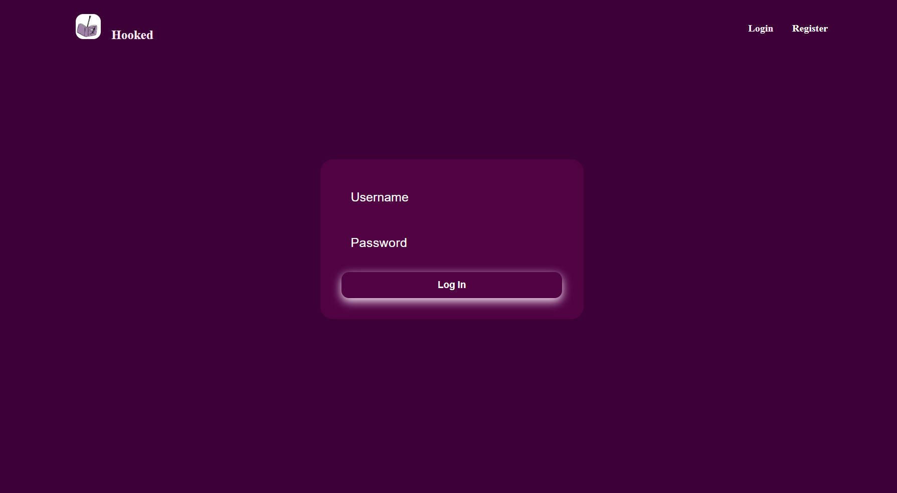
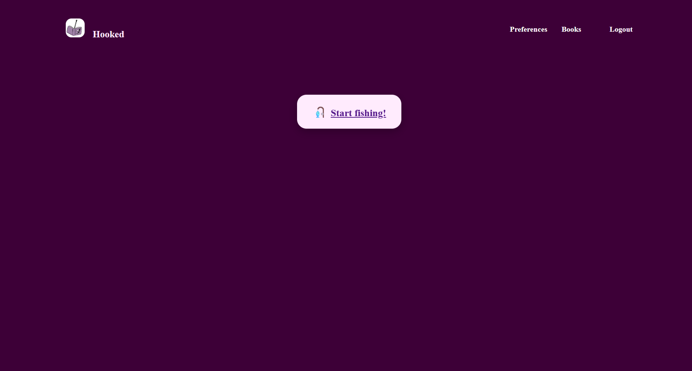
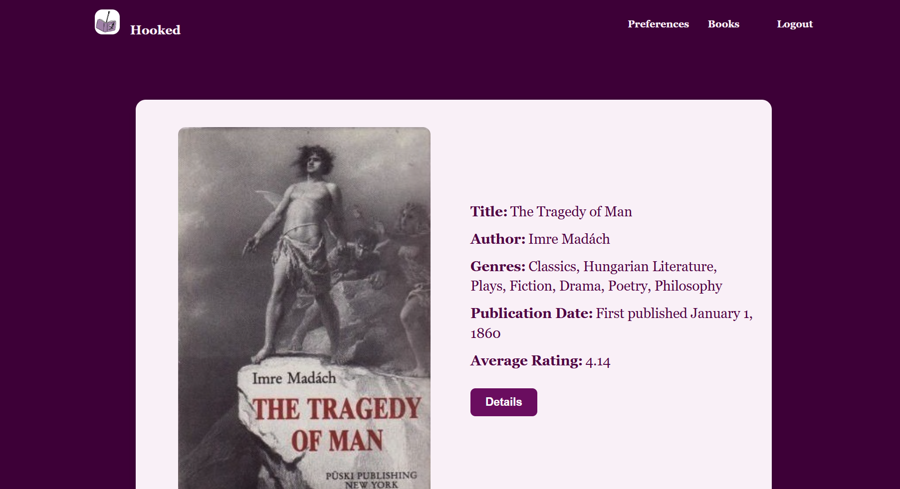
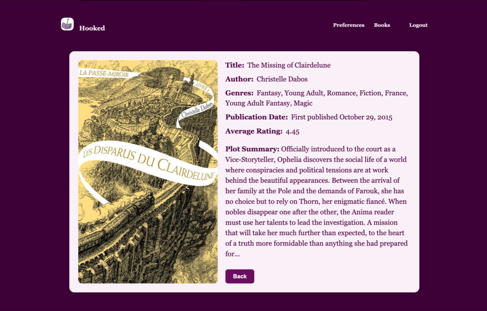
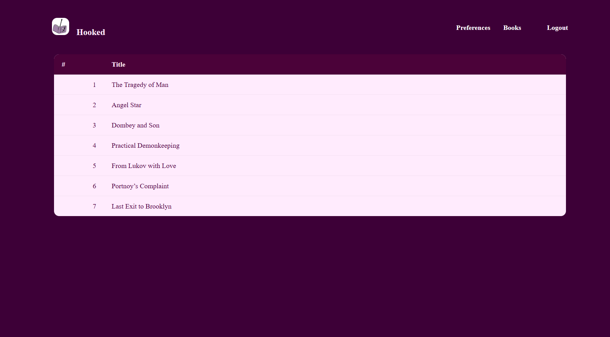

# 📚 Hooked

Hooked is a web application that lets users share their reading preferences and discover books they’ll love.  
Users can select favorite genres, list top 3 favorite books, and browse recommendations tailored to their tastes.

Edits from the repo we originally made it on: https://github.com/carolxu2006/Ignition-Hacks-Real/

---

## 🚀 Features
- **User Authentication** — Sign up, log in, and manage your account.
- **Preference Form** — Select up to 3 favorite genres.
- **Top Books** — Enter your top 3 favorite books.
- **Navigation Bar** — Quick access to login, register, preferences, books, and logout.
- **Clean and Minimalistic UI** — Modern design with pill-shaped genre tags and styled buttons.

---

## 🛠 Tech Stack
**Frontend**:
- HTML5, CSS3 (custom styles, responsive layout)

**Backend**:
- Python (Flask)
- Jinja2 templating

**Other**:
- Font styling: *Times New Roman* (customizable)
- Color palette based on deep purple and pale pink accents

---

## 📷 Screenshots

### Registeration Page


### Login Page


### Landing Page


### Preferences Page


### Fishing Page


### Details Page


### Saved Books Page

---

## ⚙️ Installation

1. **Clone the repository**  
   ```bash
   git clone https://github.com/yourusername/hooked.git
   cd hooked
   ```

2. **Create and activate a virtual environment**  
  ```bash
  python -m venv venv
  source venv/bin/activate   # macOS / Linux
  venv\Scripts\activate      # Windows
  ```

3. **Install dependencies**
  ```bash
  pip install -r requirements.txt
  ```

4. **Run the Flask app**
  ```bash
  flask run
  ```

5. **Open in your browser**
  ```bash
  http://127.0.0.1:5000
  ```
